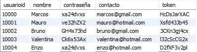
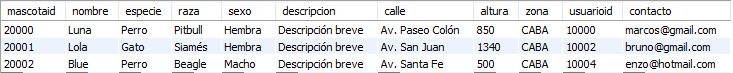
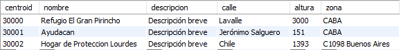

# Queries

Esto es solo información acerca de queries. Adjunto cada una de las tablas:


`usuarios`:



`mascotas`:



`centros`:




```
SHOW TABLES; 
```
Muestra todas las tablas. 


## Filtrar

```
SELECT * FROM <nombre_tabla>;
```
Trae todas las columnas de la tabla. Prácticamente se usa para ver toda la tabla.


```
SELECT <columna1>, <columna2>, ... FROM <nombre_tabla> WHERE <condición>;
```
Trae la columna o las columnas que cumplan la condición.


## Insertar:

```
INSERT INTO <nombre_tabla> (<columna1>, <columna2>, ...) VALUES (<valor1>, <valor2>, ...);
```
Inserta en la tabla, dentro de las columnas indicadas, los valores correspondientes. Si la cantidad de columnas abarcadas no suponen la totalidad de columnas en la tabla, las columnas restantes tomarán como valor NULL (si esta no autoincrementa, claro está).


```
INSERT INTO <nombre_tabla> (<valor1>, <valor2>, ...);
```
Inserta en la tabla, dentro de todas las columnas, los valores correspondientes. Prácticamente, la creación de una fila.
Ojo, la cantidad de los valores deben coincidir con la cantidad de columnas de la tabla (incluyendo aquellos que autoincrementan).


## Actualizar:

```
UPDATE <nombre_tabla> SET <columna1> = <valor1>, <columna2> = <valor2>, ... WHERE <condición>;
```
Cambia dentro de la tabla los valores de columna1, columna2 por los indicados para aquellos donde se cumple la condición.


## Crear:

```
CREATE TABLE <nombre>;
```
Crea una tabla con dicho nombre.


## Eliminar:

```
DROP TABLE <nombre_tabla>;
```
Elimina la tabla correspondiente.


```
DELETE FROM <nombre_tabla> WHERE <condición>;
```
Elimina de la tabla la fila o las filas que cumplan la condición.


## Operadores comparativos:

|   Operador   | Descripción |
|--------------|-------------|
|     `=`      |    Igual    |
|     `<>`     |  Distinto   |
|     `>`      |    Mayor    |
|     `>=`     |Mayor o igual|
|     `<`      |    Menor    |
|     `<=`     |Menor o igual|
|  `in (...)`  |   Está en   |
|`not in (...)`| No está en  |